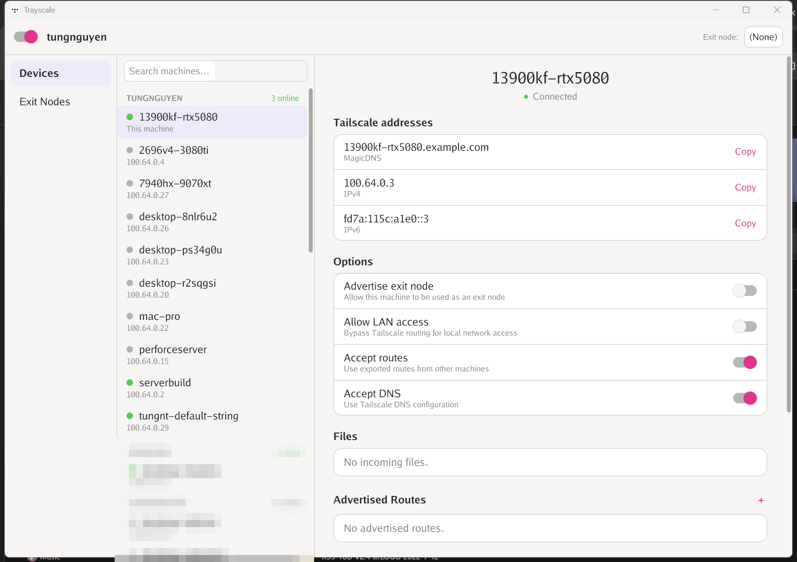
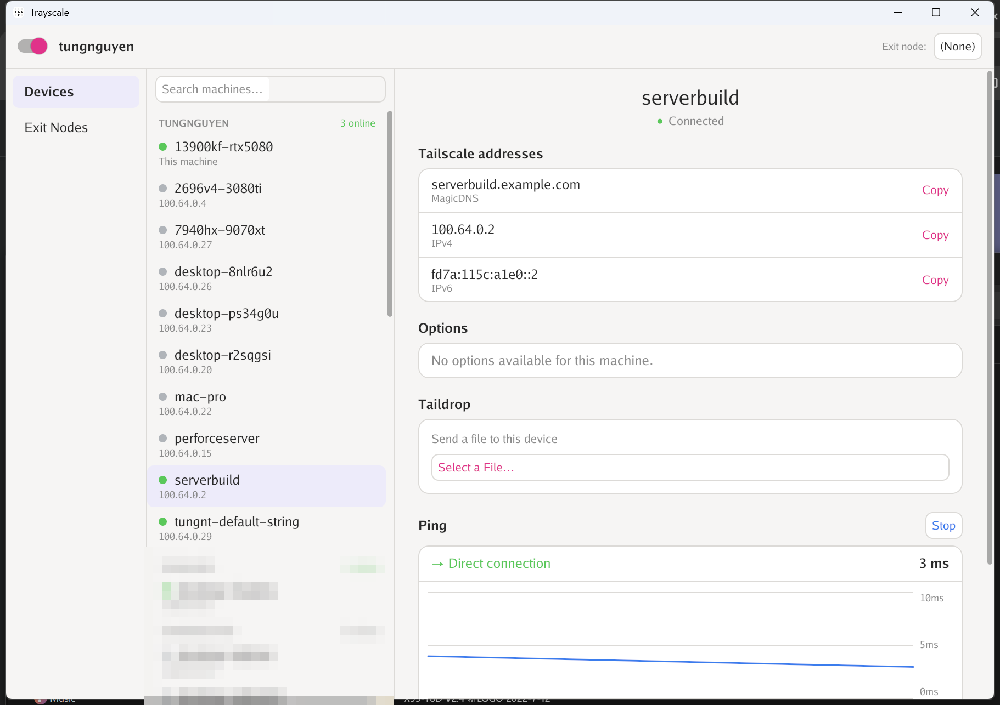
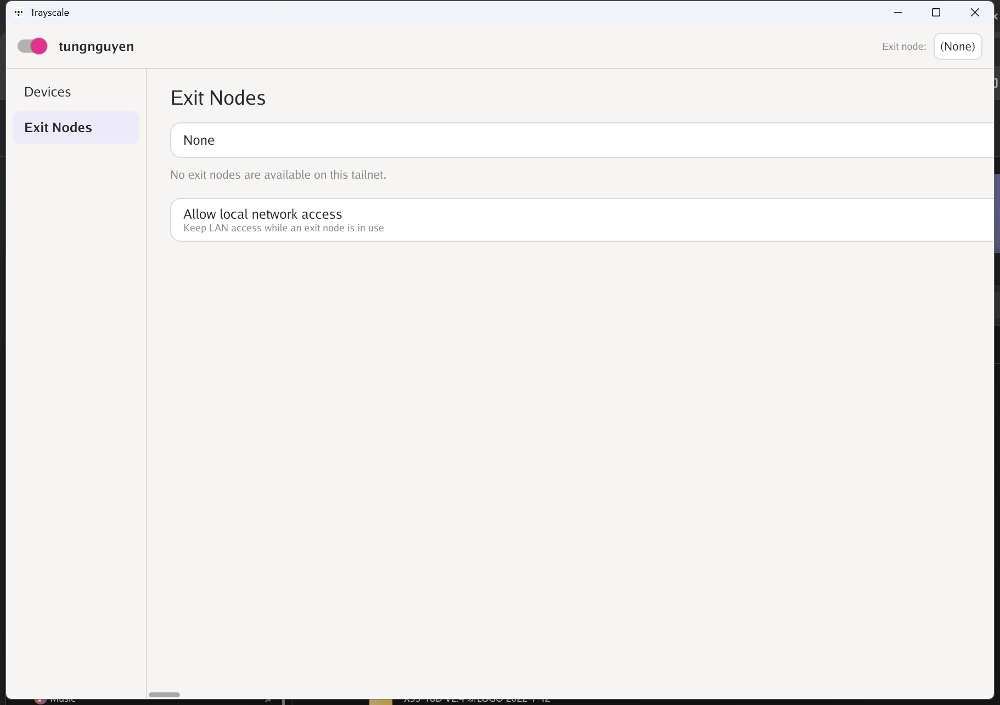

Trayscale for Windows
=====================

A native **Windows** port of [Trayscale](https://github.com/DeedleFake/trayscale) —
an unofficial GUI for the [Tailscale](https://tailscale.com) daemon.

The upstream project is a GTK4/libadwaita app for Linux and doesn't run on
Windows. This port keeps Trayscale's cross-platform core (`internal/tsutil`,
which talks to the Tailscale LocalAPI) and re-implements the UI with **pure-Go**
toolkits — **no CGO, no GTK, no MSYS2** — while adding the niceties of the
official **macOS** client.

> Not affiliated with Tailscale Inc. or the upstream Trayscale project. Built on
> top of [DeedleFake/trayscale](https://github.com/DeedleFake/trayscale) (see
> [LICENSE](LICENSE)).

Screenshots
-----------

| Devices | Live ping | Exit nodes |
|:---:|:---:|:---:|
|  |  |  |

*(Other users' names are blurred for privacy.)*

Features
--------

Two independent editions, both pure Go and sharing the same core:

### `Trayscale-GUI.exe` — full window (Gio)

* A left **nav rail** with **Devices** and **Exit Nodes** views.
* A **searchable sidebar** with machines **grouped by owner** (login name), each
  group showing an **online count**, and a small **green/grey presence dot** next
  to every device — just like the macOS client.
* A per-machine **detail pane**:
  * **Tailscale addresses** — MagicDNS, IPv4, IPv6, each with a **Copy** button.
  * **Options** (this machine) — advertise exit node, allow LAN access, accept
    routes, accept DNS, with descriptions.
  * **Taildrop** — send a file to a device.
  * **Ping** — a live, macOS-style latency graph with **Direct** / **DERP-relayed**
    connection type, auto-scaled axis, and Start/Stop.
  * **Files**, **Advertised Routes** (add/remove), **Network Check**, and
    **Details** (OS, key expiry, created, last seen).
* An **Exit Nodes** view to pick/clear your exit node and toggle LAN access.
* **Connect / Disconnect** and the current exit node in the header.

### `Trayscale.exe` — system tray

A tray icon (color-coded by state) with a menu: connect/disconnect, exit-node
picker, option toggles, peer list with copy-IP, and the admin console.

Requirements
------------

* Windows 10 / 11 (x64).
* The official **Tailscale for Windows** installed and signed in — the app talks
  to the running `tailscaled` service over its LocalAPI as the current user.
  Download: <https://tailscale.com/download/windows>.

Download & run
--------------

Grab a build from [Releases](../../releases) (or build it yourself, below) and
double-click **`Trayscale-GUI.exe`** for the window, or **`Trayscale.exe`** for
the tray icon. No install needed.

To start it with Windows, drop a shortcut in your Startup folder — see
[README-Windows.md](README-Windows.md).

Build from source
-----------------

Requires **Go >= 1.26.5**. From the repo root:

```powershell
powershell -ExecutionPolicy Bypass -File .\build-windows.ps1
```

This produces `dist\Trayscale-GUI.exe` and `dist\Trayscale.exe`. It also
embeds each executable's Windows manifest + icon via
[`go-winres`](https://github.com/tc-hib/go-winres); the manifest's `supportedOS`
block is **required** or tailscale.com's version detection panics with
*"incoherent Windows version"*.

See [README-Windows.md](README-Windows.md) for the full build/usage notes and the
list of Windows-specific packages (`cmd/trayscale-gui`, `internal/winui`,
`cmd/trayscale-win`, `internal/wintray`).

How the live ping works
-----------------------

The ping graph shells out to `tailscale ping --until-direct=false` in a fresh
process each sample. The in-process LocalAPI ping can wedge inside this
long-lived app (it times out even on a dedicated client), while a fresh CLI
process is reliable and fast (~1 s), reporting DERP first and upgrading to Direct
as the path warms up.

Credits & license
-----------------

* Based on [Trayscale](https://github.com/DeedleFake/trayscale) by DeedleFake.
* GUI built with [Gio](https://gioui.org); tray with
  [fyne.io/systray](https://github.com/fyne-io/systray).
* Same license as upstream — see [LICENSE](LICENSE).
